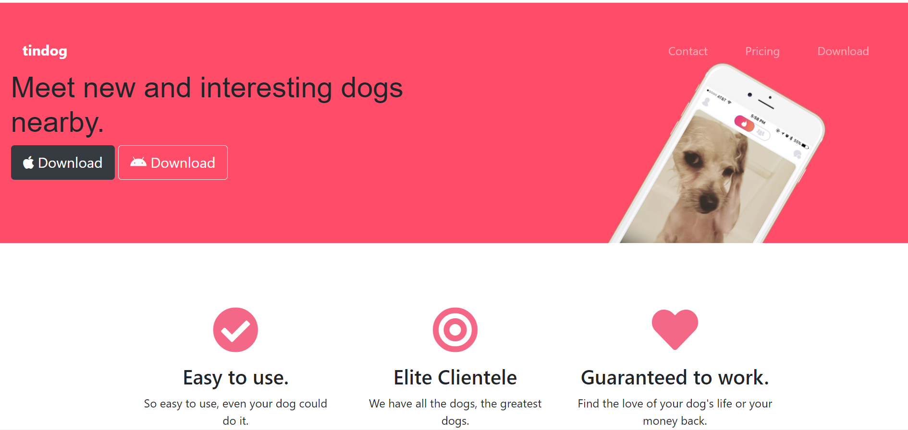
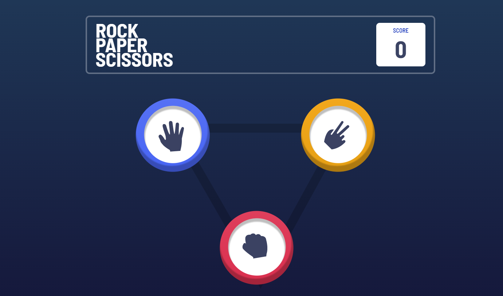
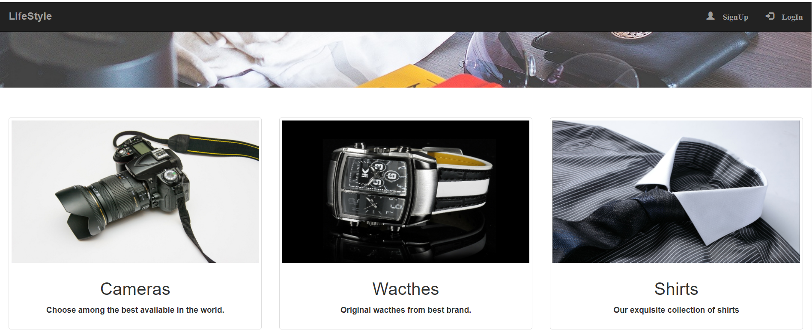

<!DOCTYPE html>
<html lang="en">
    <head>
        <meta charset="UTF-8">
        <meta name="viewport" content="width=device-width, initial-scale=1.0">
         <link rel="icon" href="favicon.ico">
        <link rel="stylesheet" href="assets/css/styles.css">

        <!-- =====BOX ICONS===== -->
        <link href='https://cdn.jsdelivr.net/npm/boxicons@2.0.5/css/boxicons.min.css' rel='stylesheet'>
        <link href="assets/css/all.css" rel="stylesheet">
        
        <title>Portfolio website complete Web</title>
    </head>
    <body>
        <!--===== HEADER =====-->
        <header class="l-header">
            

            <nav class="nav bd-grid">
                

                    <a href="#" class="nav__logo">Naveen</a>
                

                

                    <ul class="nav__list">
                       
                        <li class="nav__item"><a href="#home" class="nav__link active">Home</a></li>
                        <li class="nav__item"><a href="#about" class="nav__link">About</a></li>
                        <li class="nav__item"><a href="#skills" class="nav__link">Skills</a></li>
                        <li class="nav__item"><a href="#work" class="nav__link">Work</a></li>
                        <li class="nav__item"><a href="#contact" class="nav__link">Contact</a></li>
                    </ul>
                

                

                    <i class='bx bx-menu'></i>
                

            </nav>
        </header>

        <main class="l-main Blog">
            <!--===== HOME =====-->
            <section class="home bd-grid" id="home">
                

                    <h1 class="home__title">Hi, I'am Naveen Web Developer</h1>

                   <a href="tel:8178647180" class="button">Call me <i class="fas fa-phone"></i></a>
                

                

                    <a href="https://www.linkedin.com/in/naveen-kumar-290b81189/" class="home__social-icon"><i class='bx bxl-linkedin'></i></a>
                    <a href="https://www.hackerrank.com/naveencruz20" class="home__social-icon"><i class="fab  fa-hackerrank"></i></a>
                    <a href="https://github.com/NaveenKumar9717" class="home__social-icon"><i class='bx bxl-github' ></i></a>
                

                
    
                    
                

            </section>

            <!--===== ABOUT =====-->
            <section class="about section " id="about">
                <h2 class="section-title">About</h2>

                

                    

                        
                    

                    
                    

                        <h2 class="about__subtitle">I'am Naveen</h2>
                        
Web developer and Compitative Proggramer from DTU persuing Mathematics & Computing.
           
                    
                                   
                

            </section>

            <!--===== SKILLS =====-->
            <section class="skills section" id="skills">
                <h2 class="section-title">Skills</h2>

                
          
                    

                        <h2 class="skills__subtitle">Profesional Skills</h2>
                        
Below are the top skills on which I had worked from last 2 yers specially in javascript.

                        

                            

                                <i class='bx bxl-html5 skills__icon'></i>
                                HTML5
                            

                            

                            

                            

                                95%
                            

                        

                        

                            

                                <i class='bx bxl-css3 skills__icon'></i>
                                CSS3
                            

                            

                                
                            

                            

                                80%
                            

                        

                        

                            

                                <i class='bx bxl-javascript skills__icon' ></i>
                                JAVASCRIPT
                            

                            

                                
                            

                            

                                62%
                            

                        

                        

                            

                                <i class='bx bxs-paint skills__icon'></i>
                                NODEJS&SQL
                            

                            

                                
                            

                            

                                78%
                            

                        

                    

                    
                    
              
                        
                    

                

            </section>

            <!--===== WORK =====-->
            <section class="work section" id="work">
                <h2 class="section-title">Work</h2>

                

                    

                        
                        <h2 style ="text-align: center; margin-top: 10%;">Tindog</h2>
                    

                    

                        
                        <h2 style ="text-align: center; margin-top: 10%;">Game By Me</h2>
                    

                    

                        
                        <h2 style ="text-align: center; margin-top: 10%;">Ecom.Website by Me</h2>
                    

                    
                

            </section>

            <!--===== CONTACT =====-->
            <section class="contact section" id="contact">
                <h2 class="section-title">Contact</h2>

                

                    <form action="" class="contact__form">
                        <input type="text" placeholder="My:8178647180" class="contact__input">
                        <input type="mail" placeholder="Email : Naveencruz20@gmail.com" class="contact__input">
                        <textarea name="" id="" cols="0" rows="10" class="contact__input"></textarea>
                        <input type="button" value="Enter" class="contact__button button">
                        <!-- <h2 class ="contact__input">Conatc : 8178647180</h2> -->
                    </form>
                

            </section>
        </main>

        <!--===== FOOTER =====-->
        <footer class="footer">
            
Naveen

            

                <a href="https://www.facebook.com/naveen.cruz.1" class="footer__icon"><i class='bx bxl-facebook' ></i></a>
                <a href="#" class="footer__icon"><i class='bx bxl-instagram' ></i></a>
                <a href="#" class="footer__icon"><i class='bx bxl-twitter' ></i></a>
            

            
&#169; 2020 Made with <i style ="color: crimson;" class="fas fa-heart"></i> by NaveenKumar9717

        </footer>

        <!--===== SCROLL REVEAL =====-->
        

        <!--===== MAIN JS =====-->
        
    </body>
</html>

